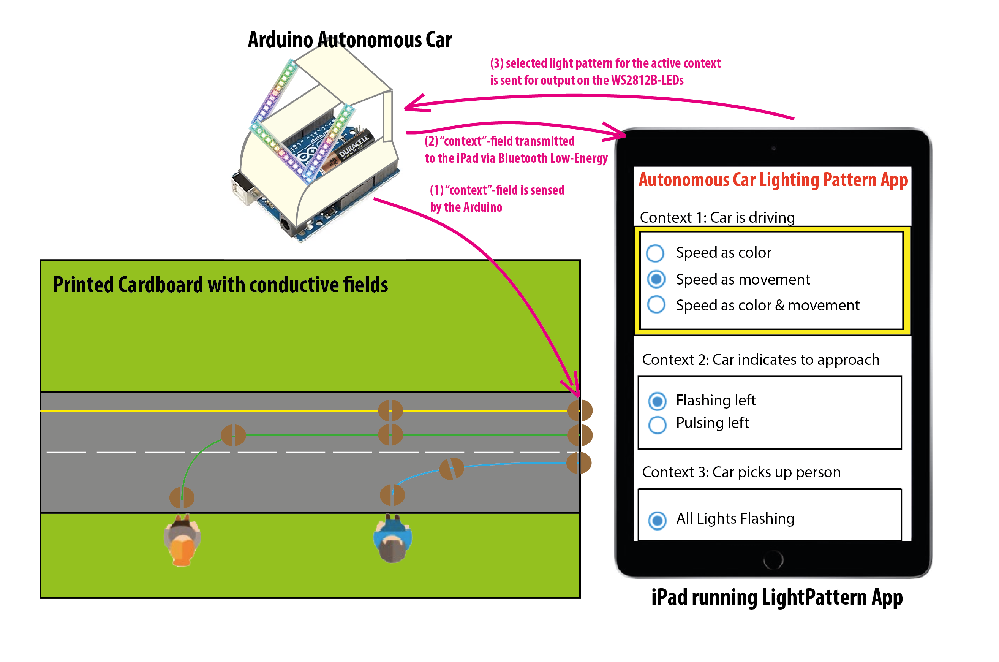

# Tangible Multi-Display Toolkit


This design toolkit supports the study of interaction between autonomous vehicles and pedestrian via tangible objects and multiple displays. The project was first presented in [OZCHI 2020](http://www.ozchi.org/2020/program.html).

Please read this guide in conjunction with the paper *(link to be updated soon)* to understand how the toolkit can help your research.

The toolkit has three main components:
- View application: Top-down and First-person point of view
- Participant controller application
- 3D printed car with touchpoints.

|  | 
|:--:| 
| *Three components of toolkit* |


## Installation

### View app

Steps to install the application on three iPads:

- Clone this repo

```markdown
git clone https://github.com/ryanntt/tangible-multi-display-toolkit.git
```

- Initialize the Unity project

As we all used standard packages for Unity, once you import the project, the initialization will download required assets from Unity Store. The assets not available on Unity Store are kept to small sizes in the repository.

The project works well on version 2019.1.0f2. It should work with the newer versions of Unity and Xcode with some adjustment. 

- Configure the IP address of the controller

In this repository for Camera view, we are using [Photon Realtime](https://www.photonengine.com/en-US/Realtime) to sync the position of care between all devices. This project is currently using my project's quota and it is limited to 20 players at the same time. Please feel free to use it or setup your own for more quota.

As the controller iPad needs to have fixed IP to communicate with the view iPads, we will need to have our local network. We used **GL-MT300N-V2 Travel Router** in our study but any other hotspot device should do the job.

In `Assets/Scripts/UDPReceive.cs` line 27:
```
    public string IP = "192.168.0.107";
```

Please use your own IP number here. If you want to customize, please read on. Otherwise, skip to [Deployment and Setup](#deployment-and-setup)
### Controller app

- Clone the repo:
```
git clone https://github.com/HoggenMari/AVLightingToolkit.git
```

There is no quick and easy way to customize the controller app. Please continue to [Deployment and Setup](#deployment-and-setup).

### 3D printed car with touchpoints

*To be updated soon.*
___
## Configuration

### LED Colours
We use HEX value to display the color. This might be difficult for lighting designer to manipulate the colours. You will need a converter to get HEX from HSL or RGB. There are many web tools available online for this. We used [colourslurp](https://colourslurp.com/) on Mac.


To change colour of LED in Script, run public function ```ChangeColor()``` using following syntax:
```ChangeColor(string[] string )```

For example:

```ChangeColor(new string[] { "#00FF00", "#FF0000", "#0000FF", "#00FF00", "#FF0000", "#0000FF" });```

The function will change colours of all 21 LEDs. If the number of colours is less than 21, then random colours will be assigned. This function is declared in file ```Scripts/LEDControl.cs```.

### Context

To change the text of any indicator, target ``Context Manager script`` in ``object Context Manager`` and run public function:
`UpdateContext(int i, string text)` to update the text of context **i**th. **i** ranges from 1 to 4.

___
## Deployment and Running

After installing the project in Unity and configuring the toolkit, we can deploy the applications to iPads.

### View apps
In `Project` panel, go to `Assets/Scenes`, you should see 2 unity files:
- CityCar-Scene
- Park-Scene

They are examples that you can run with, and will be good reference for how to setup environment and interactive elements.

Go to menu `Files/ Build Settings`
- Choose the scene you want to build
- Select Platform: default is PC, Mac. Please select iOS and install the required packages to build the application for iOS.

Once you have Unity for iOS package downloaded and installed, you can build this application for iPad. We recommend [Getting started with iOS development](https://docs.unity3d.com/Manual/iphone-GettingStarted.html) if you are new to iOS Unity development.

In our setup, we have the app installed in three iPads. It's important that they have the same scene selected when deployed.

### Controller app

Same as above

### Running

The sequence of which view application start will determine the view it display:
- 1st app: Top-down view has starting point of the vehicle
- 2nd app: Top-down view has pedestrian
- 3rd app: First-person point of view
___
## Questions and Support

We document [known issues in Github](https://github.com/ryanntt/tangible-multi-display-toolkit/issues). Please look for existing issues before creating a new one.

If you have any questions, please feel free to [open an issue ticket in Github](https://github.com/ryanntt/tangible-multi-display-toolkit/issues/new).
___
## Contributing

Having trouble with Pages? Check out our [documentation](https://docs.github.com/categories/github-pages-basics/) or [contact support](https://github.com/contact) and we’ll help you sort it out.